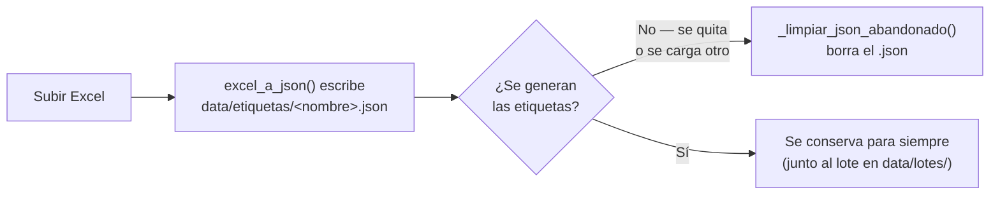
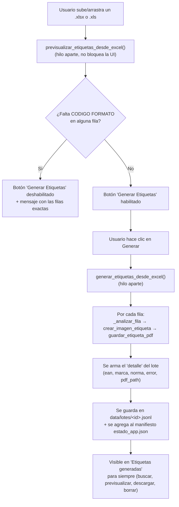

# Manual Técnico — Generador de Etiquetas

## 1. Descripción general

**Generador de Etiquetas** es una aplicación de escritorio para Windows (Python + customtkinter) que convierte un archivo Excel de productos en un lote de etiquetas individuales en PDF (con texto seleccionable/copiable) y en Word (.docx), conforme a las Normas Oficiales Mexicanas (NOM) configuradas en el sistema.

Flujo en una frase: **subes un Excel → el sistema detecta la norma de cada fila por la columna `CODIGO FORMATO` → genera un PDF y un Word por etiqueta → el lote queda en un historial buscable y editable.**

La app tiene tres secciones:

| Sección | Para qué sirve |
|---|---|
| **Generador** | Subir el Excel, revisar el análisis y disparar la generación de PDFs y Word |
| **Etiquetas generadas** | Buscar, previsualizar, descargar o borrar cualquier etiqueta de cualquier lote generado (histórico completo, no solo el último) |
| **Configuración** | Dar de alta nuevas normas o editar qué campos lleva cada una, sin tocar código |

---

## 2. Stack tecnológico

| Capa | Tecnología | Rol |
|---|---|---|
| Interfaz | `customtkinter` sobre Tkinter | Ventana, widgets, temas |
| Drag & drop | `tkinterdnd2` (opcional) | Arrastrar el Excel al dropzone; si no está disponible, la app cae a solo selector de archivo |
| Lectura de Excel | `pandas` + `openpyxl` (.xlsx) / `xlrd` (.xls) | Convertir cada fila del Excel a un `dict` |
| Generación de PDF | `reportlab` | Escribe la etiqueta como texto real (Arial Bold incrustada) en un PDF del tamaño exacto de la etiqueta, para que el texto se pueda seleccionar, copiar y pegar |
| Generación de Word | `python-docx` | Crea un `.docx` del mismo tamaño y acomodo (tabla de una celda con borde) para editar la etiqueta |
| Vista previa de PDF | `PyMuPDF` (`fitz`) | Renderiza la primera página de un PDF ya generado como imagen, para el botón 👁 |
| Empaquetado a `.exe` | `PyInstaller` | Ver [`build_exe.bat`](#9-empaquetado-build_exebat) |

Todas las versiones exactas están fijadas en [`requierements`](#10-dependencias-requierements) (nombre del archivo tal cual está en el repo, con la falta de ortografía incluida).

---

## 3. Estructura del repositorio

```
Generador Etiquetas/
├── app.py                  # Interfaz gráfica completa (una sola clase, una sola ventana)
├── armadoEtiqueta.py        # Lógica de negocio: Excel → validación → layout → PDF + Word
├── configuracion.py         # CRUD de normas sobre data/config_etiquetas.json
├── build_exe.bat            # Script de empaquetado a ejecutable de Windows
├── requierements             # Dependencias pip (congeladas por versión)
├── img/                      # Icono del ejecutable (img/icono.ico), sin uso en runtime
└── data/
    ├── config_etiquetas.json # Catálogo de normas y sus campos (editable desde "Configuración")
    ├── estado_app.json       # Manifiesto liviano de todos los lotes generados
    ├── lotes/                # Un .jsonl por lote, con el detalle de cada etiqueta generada
    └── etiquetas/             # Excel→JSON crudo de cada archivo subido (ver ciclo de vida abajo)
```

`app.py` y `armadoEtiqueta.py` resuelven todas las rutas de `data/` como **rutas relativas al directorio de trabajo actual**, no hay un mecanismo de rutas absolutas ni de recursos empaquetados (`sys._MEIPASS`). Esto es intencional para que el ejecutable compilado siga leyendo/escribiendo junto a sí mismo, pero significa que **la app debe ejecutarse siempre desde la carpeta del proyecto** (o, una vez compilada, desde la carpeta donde vive el `.exe` junto a su copia de `data/`).

---

## 4. Arquitectura de datos en disco

Cuatro archivos/carpetas conforman todo el estado persistente. Ninguno es una base de datos: todo es JSON o JSON Lines plano.

### 4.1 `data/config_etiquetas.json` — catálogo de normas

Diccionario `{ "NOM-XXX-...": { "campos": [...] } }`. Es la única fuente de verdad sobre qué normas existen y qué campos lleva cada una. Se edita a mano o desde la pantalla **Configuración** (vía `configuracion.py`).

```json
{
  "NOM-020-SCFI-1997": {
    "campos": ["EAN", "MARCA", "INSUMOS", "PAIS ORIGEN", "IMPORTADOR"]
  }
}
```

### 4.2 `data/estado_app.json` — manifiesto de lotes (liviano)

Lista de lotes generados, **sin** el detalle de cada etiqueta (eso vive aparte, ver 4.3). Se mantiene deliberadamente pequeño para que cargar el historial al abrir la app sea instantáneo sin importar cuántos lotes se acumulen.

```json
{
  "lotes": [
    {
      "id": "PRUEBA_EFRA_xlsx_20260730094429",
      "nombre_excel": "PRUEBA EFRA.xlsx",
      "fecha": "30/07/2026 · 09:44",
      "output_dir": "C:/Users/.../Etiquetas_PRUEBA EFRA_20260730_094429",
      "json_path": "data/etiquetas/PRUEBA EFRA.json",
      "detalle_path": "data/lotes/PRUEBA_EFRA_xlsx_20260730094429.jsonl",
      "total_filas": 10711,
      "generadas": 10343,
      "total_detalle": 10711
    }
  ]
}
```

Formato antiguo soportado por compatibilidad: si un lote trae `detalle` embebido directamente (versiones previas de la app, antes de la migración a almacenamiento modular), `_migrar_lote_a_jsonl` en `app.py` lo detecta al cargar y lo convierte automáticamente al formato nuevo, escribiendo su `.jsonl` y reescribiendo el manifiesto.

### 4.3 `data/lotes/<id>.jsonl` — detalle real de cada lote

Un objeto JSON por línea, uno por fila del Excel de ese lote:

```jsonl
{"fila": 1, "ean": "4501130", "marca": "SOLOGNAC", "norma": "NOM-020-SCFI-1997", "campos": ["EAN","MARCA","INSUMOS","PAIS ORIGEN","IMPORTADOR"], "error": null, "pdf_path": "C:/.../4501130_NOM-020-SCFI-1997.pdf"}
```

Esta es la fuente que alimenta la pantalla **Etiquetas generadas**. Nunca se carga completo en memoria: se lee **bajo demanda** por rango de líneas usando un índice de offsets de byte construido una sola vez por archivo (`_indice_lote`), y solo para los lotes que efectivamente caen dentro de la página que se está mostrando (`_leer_pagina_historial`).

### 4.4 `data/etiquetas/<nombre_excel>.json` — volcado crudo del Excel

Lista de `dict` con **todas las columnas del Excel tal cual**, sin procesar. Es un artefacto de depuración/trazabilidad (permite inspeccionar exactamente qué leyó `pandas` de cada celda), no lo usa la pantalla "Etiquetas generadas".

**Ciclo de vida** (lo más particular del proyecto — ha cambiado varias veces durante el desarrollo, esta es la versión vigente):

1. Al **subir** un Excel, `excel_a_json` lo escribe de inmediato en `data/etiquetas/<nombre>.json` (para poder inspeccionarlo aunque el usuario nunca termine de generar).
2. Si el usuario **nunca hace clic en "Generar Etiquetas"** y quita el archivo (botón ✕) o carga uno distinto, `app._limpiar_json_abandonado()` borra ese `.json` — no debe quedar huérfano un archivo que nunca se usó.
3. Si el usuario **sí genera** las etiquetas, `app._generacion_completada` marca `self._archivo_generado = True` y el `.json` se conserva **permanentemente**, junto con el resto del historial del lote en `data/lotes/`.



---

## 5. Flujo funcional completo



Puntos clave de este flujo:

- **Análisis y generación corren en hilos (`threading.Thread`) separados del hilo de UI**, comunicándose de vuelta con `self.root.after(0, callback, ...)`. Esto es constante en toda la app: nunca se hace I/O pesado directamente en un callback de botón.
- `_analizar_fila` (en `armadoEtiqueta.py`) es la **única** función que decide si una fila es válida y con qué norma — la usan tanto la previsualización como la generación real, así que ambas siempre coinciden en qué fila pasa y cuál no.
- La validación de la columna `CODIGO FORMATO` (ver [sección 7.1](#71-codigo-formato-es-obligatorio-en-todas-las-filas)) se aplica **dos veces**: en la previsualización (para deshabilitar el botón con un mensaje claro) y otra vez dentro de `generar_etiquetas_desde_excel` (como último guardián, por si se llama a esa función directamente sin pasar por la UI).

---

## 6. Módulos y funciones

### 6.1 `armadoEtiqueta.py` — lógica de negocio pura

Sin dependencia de Tkinter; se podría usar desde una CLI (de hecho tiene un `main()` para eso: `python armadoEtiqueta.py <excel> <carpeta_salida>`).

| Función | Qué hace |
|---|---|
| `cargar_config_etiquetas(config_path)` | Lee `data/config_etiquetas.json` |
| `construir_mapa_numero_a_norma(config)` | Mapea el número de norma (ej. `4`, `20`, `50`) → su clave completa (`NOM-020-SCFI-1997`), extraído por regex `NOM-(\d+)` |
| `extraer_numero_norma(valor)` | Extrae el primer número de la celda `CODIGO FORMATO` (ej. `"NOM004TEXX"` → `4`) |
| `buscar_valor_columna(fila, campo)` | Busca un valor en la fila tolerando variaciones de mayúsculas/espacios en el nombre de columna |
| `formatear_valor(campo, valor)` | Aplica prefijos especiales por campo — ver [7.2](#72-formateo-especial-de-campos) |
| `extraer_campos_etiqueta(fila, campos)` | Arma la lista `(campo, texto_formateado)` para los campos con valor, en el orden que define la norma |
| `excel_a_json(excel_path, carpeta_salida)` | Lee el Excel con `pandas`, lo convierte a `list[dict]` y lo escribe de inmediato en `data/etiquetas/` |
| `_analizar_fila(fila, idx, mapa, config)` | Determina norma + campos + error de una fila. Punto único de verdad compartido por previsualización y generación |
| `_filas_sin_codigo_formato(registros)` | Lista de números de fila (1-based) sin valor en `CODIGO FORMATO` |
| `previsualizar_etiquetas_desde_excel(excel_path, ...)` | Analiza sin generar PDFs; devuelve resumen + `filas_sin_codigo_formato` para la UI |
| `crear_imagen_etiqueta(campos_texto)` | Dibuja la etiqueta como imagen PIL, con ancho/alto dinámicos según el contenido (mínimo 700×380 px @ 300 DPI) |
| `calcular_layout_etiqueta(campos_texto)` | Calcula bloques, líneas, tamaños de fuente y medidas (en puntos) de la etiqueta; lo comparten PDF y Word |
| `guardar_etiqueta_pdf(layout, orientacion, ruta_salida)` | Escribe el PDF con texto real (seleccionable/copiable) del tamaño exacto de la etiqueta |
| `guardar_etiqueta_docx(layout, orientacion, ruta_salida)` | Escribe el `.docx` con el mismo tamaño, borde y acomodo; en horizontal gira el texto de la celda |
| `_ruta_salida_unica(output_dir, nombre_base, nombres_usados)` | Devuelve la ruta base (sin extensión); `nombres_usados` evita que dos etiquetas con el mismo nombre se sobreescriban (les agrega sufijo `_2`, `_3`, …) |
| `generar_etiquetas_desde_excel(excel_path, output_dir, ...)` | Orquesta todo: valida, genera un PDF y un Word por fila válida, devuelve el `detalle` completo del lote |

**Layout de la etiqueta** (`calcular_layout_etiqueta`): los campos se agrupan en tres bloques verticales — encabezado (`EAN`, luego `MARCA`, centrados y en fuente grande), cuerpo (el resto de los campos de la norma) y pie (`IMPORTADOR` y `TALLA`, si existen). El texto largo se envuelve con `textwrap` (32 caracteres en encabezado, 38 en cuerpo/pie). El tamaño final de la etiqueta —y por lo tanto del PDF y del Word— se calcula sumando las alturas de cada bloque más márgenes fijos, así que **cada etiqueta tiene un tamaño de página distinto** según cuánto texto lleve.

### 6.2 `app.py` — interfaz gráfica

Una sola clase, `GenerdorEtiquetas`, que construye la ventana en `__init__` y entra a `self.root.mainloop()`. No hay separación de vistas en archivos aparte: las tres páginas (Generador, Etiquetas generadas, Configuración) son métodos `_crear_pagina_*` dentro de la misma clase, montados una vez y mostrados/ocultados con `.pack()` / `.pack_forget()` — nunca se destruyen.

#### Página Generador
`_crear_pagina_generador`, `_render_dropzone_*`, `_construir_stepper`, `_cargar_archivo`, `_analizar_en_hilo` / `_analisis_completado`, `generar_pdf`, `_generar_en_hilo` / `_generacion_completada`.

Stepper de 4 pasos (`Archivo cargado → Analizando datos → Generando PDF y Word → Finalizado`), zona de "Actividad reciente" que va acumulando entradas con `_agregar_actividad`, y un banner final de éxito/error.

#### Página Etiquetas generadas
La más compleja de la app, con tres optimizaciones deliberadas (detalladas en la [sección 8](#8-rendimiento-y-decisiones-de-diseño)):

- **Paginación** (`ETIQUETAS_POR_PAGINA = 50`) en vez de listar todo el historial.
- **Lectura perezosa por rango de bytes** (`_indice_lote`, `_leer_lineas_lote`, `_leer_pagina_historial`) — nunca se abre un `.jsonl` completo salvo que la búsqueda lo requiera.
- **Pool de widgets reutilizados** (`_crear_fila_etiqueta_widgets` + `_actualizar_fila_etiqueta`) en vez de destruir y reconstruir las filas en cada cambio de página.

Búsqueda por EAN o norma con *debounce* de 350&nbsp;ms (`_filtrar_etiquetas` → `_ejecutar_busqueda` → hilo `_buscar_en_hilo` → `_busqueda_completada`), que escanea todos los `.jsonl` línea por línea (no hay índice de texto — es una búsqueda lineal, aceptable porque corre en segundo plano y no bloquea la interfaz).

Cada fila tiene cuatro acciones: 👁 vista previa (`_previsualizar_pdf`, renderiza la primera página del PDF con PyMuPDF), ⬇ descargar (`_descargar_pdf`, copia el PDF a donde el usuario elija), ⬇ descargar Word (`_descargar_word`, igual con el `.docx`) y 🗑 eliminar (`_confirmar_eliminar_etiqueta` → `_eliminar_etiqueta`, que reescribe el `.jsonl` sin esa línea, borra el PDF y el Word, y si el lote se queda en cero etiquetas lo retira por completo del historial).

#### Página Configuración
`_crear_pagina_configuracion` + `_refrescar_lista_normas` / `_refrescar_editor_norma`. Panel izquierdo con la lista de normas (clic para seleccionar), panel derecho como editor: agregar/quitar campos (`_agregar_campo_editor` / `_quitar_campo_editor`), crear norma nueva (`_iniciar_nueva_norma`), guardar (`_guardar_norma_editor`, delega la validación y persistencia a `configuracion.py`) o eliminar (`_eliminar_norma_editor`, con confirmación).

#### Funciones a nivel de módulo (fuera de la clase)
Gestión del manifiesto de lotes: `_slug`, `_ruta_lote_unica`, `_guardar_detalle_lote`, `_migrar_lote_a_jsonl`, `_cargar_manifiesto_lotes`, `_guardar_manifiesto_lotes`.

### 6.3 `configuracion.py` — CRUD de normas

Capa delgada sobre `data/config_etiquetas.json`, sin ninguna dependencia de Tkinter (la usa `app.py`, pero podría reutilizarse desde un script o una futura CLI).

| Función | Qué hace |
|---|---|
| `cargar_config` / `guardar_config` | Leer/escribir el JSON completo |
| `listar_normas` / `obtener_campos` | Consultas de solo lectura |
| `validar_nombre_norma(nombre, config, excluir)` | Exige el patrón `NOM-<número>` (el mismo regex que usa `armadoEtiqueta.construir_mapa_numero_a_norma`, para que una norma nueva sea realmente reconocible) y **rechaza que dos normas compartan el mismo número** — si eso pasara, el generador solo podría usar una de las dos, y silenciosamente ignoraría la otra |
| `agregar_norma` / `eliminar_norma` / `actualizar_campos_norma` | Mutaciones sobre el diccionario en memoria (no persisten solas — hay que llamar `guardar_config` después) |
| `agregar_campo` / `eliminar_campo` | Helpers de más bajo nivel, no usados actualmente por la UI (que maneja la lista de campos completa vía `actualizar_campos_norma`), disponibles para uso programático |

---

## 7. Reglas de negocio

### 7.1 `CODIGO FORMATO` es obligatorio en **todas** las filas

Es la columna que le dice al sistema qué norma (y por lo tanto qué campos y qué armado) le corresponde a cada etiqueta. La regla, reforzada varias veces durante el desarrollo hasta llegar a la versión estricta actual:

> Si **cualquier fila** del Excel no trae un valor en `CODIGO FORMATO` (columna ausente o celda vacía), **no se genera nada** — ni siquiera las filas que sí están completas — hasta que se corrija el archivo.

Esto se aplica en dos capas independientes (`_filas_sin_codigo_formato`):
1. En la UI, al analizar el archivo (`app._analisis_completado`): deshabilita el botón y muestra un error con los números de fila exactos.
2. Dentro de `generar_etiquetas_desde_excel` misma, como `ValueError` — así que aunque algo llamara a esa función sin pasar por la UI, sigue sin poder generar un lote incompleto.

Los **demás** tipos de error de fila (código que no coincide con ninguna norma configurada, o fila sin datos para los campos de su norma) sí se comportan distinto: esa fila puntual se omite y se reporta en `errores`, pero el resto del lote se genera con normalidad.

### 7.2 Formateo especial de campos

`formatear_valor` antepone texto fijo a ciertos campos, sea cual sea su valor:

| Campo | Transformación | Ejemplo |
|---|---|---|
| `PAIS ORIGEN` / `PAIS DE ORIGEN` / `PAIS` | `"HECHO EN {valor}"` (mayúsculas) | `MEXICO` → `HECHO EN MEXICO` |
| `TALLA` | `"TALLA {valor}"` | `M` → `TALLA M` |
| `FORRO` | `"FORRO {valor}"` (mayúsculas) | `ALGODON` → `FORRO ALGODON` |

> **Nota técnica:** la condición para `FORRO` está escrita como `if campo_norm in ("FORRO"):`. Al faltarle la coma final, Python no interpreta `("FORRO")` como una tupla de un elemento sino como el string `"FORRO"` plano, así que `in` hace **verificación de substring**, no de igualdad — el bloque se dispara para cualquier `campo_norm` que sea substring de `"FORRO"` (`"FOR"`, `"ORRO"`, `"R"`, etc.), no solo para el campo exactamente llamado `FORRO`. En la práctica no suele causar problemas porque los nombres de campo de las normas configuradas no chocan con substrings de "FORRO", pero conviene tenerlo presente si se agrega algún campo con un nombre corto parecido. La forma correcta sería `campo_norm == "FORRO"` o `campo_norm in ("FORRO",)`.

### 7.3 Nomenclatura y de-duplicación de archivos PDF / Word

Cada etiqueta se guarda como `<EAN>_<NORMA>.pdf` y `<EAN>_<NORMA>.docx` (o `FILA<n>_<NORMA>` si la fila no trae EAN). Si dos filas del mismo lote producen el mismo nombre, `_ruta_salida_unica` les agrega un sufijo incremental (`_2`, `_3`, …) usando el diccionario compartido `nombres_usados`, para que nunca se sobreescriban entre sí dentro de una misma corrida.

### 7.4 Validación de nombres de norma (pantalla Configuración)

`configuracion.validar_nombre_norma` exige:
- Que el nombre contenga `NOM-<número>` (mismo patrón que usa el motor de generación para reconocerla).
- Que no exista ya una norma con ese nombre exacto.
- Que **ningún otro** nombre de norma extraiga el mismo número — de lo contrario, dos normas competirían por la misma fila del Excel y una de las dos quedaría inalcanzable sin ningún aviso.

---

## 8. Rendimiento y decisiones de diseño

Estas cuatro decisiones existen porque el volumen real de datos (lotes de ~10,000 etiquetas, y varios lotes acumulándose con el tiempo) rompía la implementación ingenua original. Se documentan aquí porque no son obvias leyendo el código aislado.

| Problema original | Síntoma | Solución |
|---|---|---|
| "Etiquetas generadas" construía un widget de Tkinter por cada etiqueta del lote (~7 widgets × 10,000+ filas) | La app se congelaba varios minutos al abrir esa pestaña | **Paginación** a 50 filas por página (`ETIQUETAS_POR_PAGINA`) |
| `estado_app.json` guardaba el detalle completo de cada lote embebido | El archivo crecía sin límite (4+&nbsp;MB por lote de 10,000 filas) y tardaba en cargar/guardar en cada operación | **Separar manifiesto (liviano) de detalle** (`data/lotes/*.jsonl`), leído perezosamente por rango |
| Cada cambio de página destruía y reconstruía todas las filas | Parpadeo/"pixelado" visible — CustomTkinter dibuja mal los bordes redondeados de un widget recién creado hasta que su geometría se asienta | **Pool de widgets reutilizados**: se crean una vez y solo se reconfigura su contenido |
| La lectura de página y la búsqueda ocurrían en el hilo de UI | Cambiar de página o escribir en el buscador se sentía trabado | Ambas corren en `threading.Thread` con un **ID de petición** para descartar resultados obsoletos si el usuario navega antes de que termine (`_peticion_pagina_id`, chequeo de `consulta` vigente en `_busqueda_completada`) |

Patrón repetido en toda la app para evitar bloquear el hilo de Tkinter: *lanzar hilo → hilo hace el trabajo pesado → `self.root.after(0, callback, resultado)` entrega el resultado de vuelta al hilo principal para tocar la UI.* Tkinter no es thread-safe, así que **ningún hilo secundario toca un widget directamente** — siempre pasa por `root.after`.

---

## 9. Empaquetado (`build_exe.bat`)

Genera un ejecutable de Windows de un solo archivo con PyInstaller:

```bat
python -m PyInstaller --noconfirm --clean --windowed --onefile ^
  --name GeneradorEtiquetas --icon "img\icono.ico" ^
  --hidden-import openpyxl --hidden-import xlrd --hidden-import PIL._tkinter_finder ^
  --collect-all customtkinter --collect-all tkinterdnd2 --collect-all reportlab ^
  --collect-all pillow --collect-all pymupdf ^
  app.py
```

Notas:
- `--hidden-import openpyxl` / `xlrd`: pandas los carga dinámicamente según la extensión del archivo (`.xlsx` vs `.xls`), y el análisis estático de PyInstaller no siempre los detecta solo.
- `--collect-all tkinterdnd2` / `pymupdf`: ambas librerías traen archivos binarios/de datos no-Python (paquete Tcl de `tkdnd`, recursos de `MuPDF`) que PyInstaller no incluye automáticamente sin este flag.
- **Después del build**, el script copia `data/config_etiquetas.json` a `dist/data/config_etiquetas.json`. Es necesario porque, como se explicó en la [sección 3](#3-estructura-del-repositorio), la app resuelve `data/` como ruta relativa al directorio de ejecución — empaquetar la carpeta con `--add-data` no serviría porque PyInstaller la extraería a una carpeta temporal (`sys._MEIPASS`) que el código nunca consulta.
- El ejecutable resultante (`dist/GeneradorEtiquetas.exe`) debe distribuirse **junto con** `dist/data/`, no solo, para poder arrancar.

---

## 10. Dependencias (`requierements`)

Instalación: `pip install -r requierements` (el nombre del archivo tiene la falta de ortografía tal cual).

Las relevantes en runtime están descritas en la [sección 2](#2-stack-tecnológico). El resto (`pyinstaller-hooks-contrib`, `altgraph`, `pefile`, `pywin32-ctypes`, etc.) son dependencias transitivas de PyInstaller para el build, y `docxtpl`/`PyPDF2`/`tkcalendar`/`pyxlsb` no se usan actualmente en el código — parecen quedar de un alcance previo o futuro del proyecto.

---

## 11. Limitaciones conocidas

- **Un solo usuario, sin bloqueo de archivos concurrente.** Si dos instancias de la app corrieran a la vez sobre la misma carpeta `data/`, podrían pisarse escrituras (no hay locking).
- **Específico de Windows:** usa `os.startfile` para abrir carpetas del explorador, y la carga de fuente (`RUTAS_FUENTE`) prioriza rutas de Windows (`C:/Windows/Fonts/arialbd.ttf`) con un *fallback* a Liberation Sans (típico de Linux) y finalmente a la fuente por defecto de Pillow si ninguna se encuentra.
- **Búsqueda sin índice:** escanea todos los `.jsonl` línea por línea; para historiales muy grandes (varias decenas de miles de etiquetas acumuladas) empieza a tomar un tiempo perceptible, aunque corre en segundo plano y no congela la interfaz.
- **La particularidad de `FORRO`** descrita en [7.2](#72-formateo-especial-de-campos).
- **`data/etiquetas/` no se limpia retroactivamente:** la lógica de "borrar si nunca se generó" solo aplica hacia adelante, a partir de la versión actual del código — archivos huérfanos de sesiones anteriores no se eliminan automáticamente.
